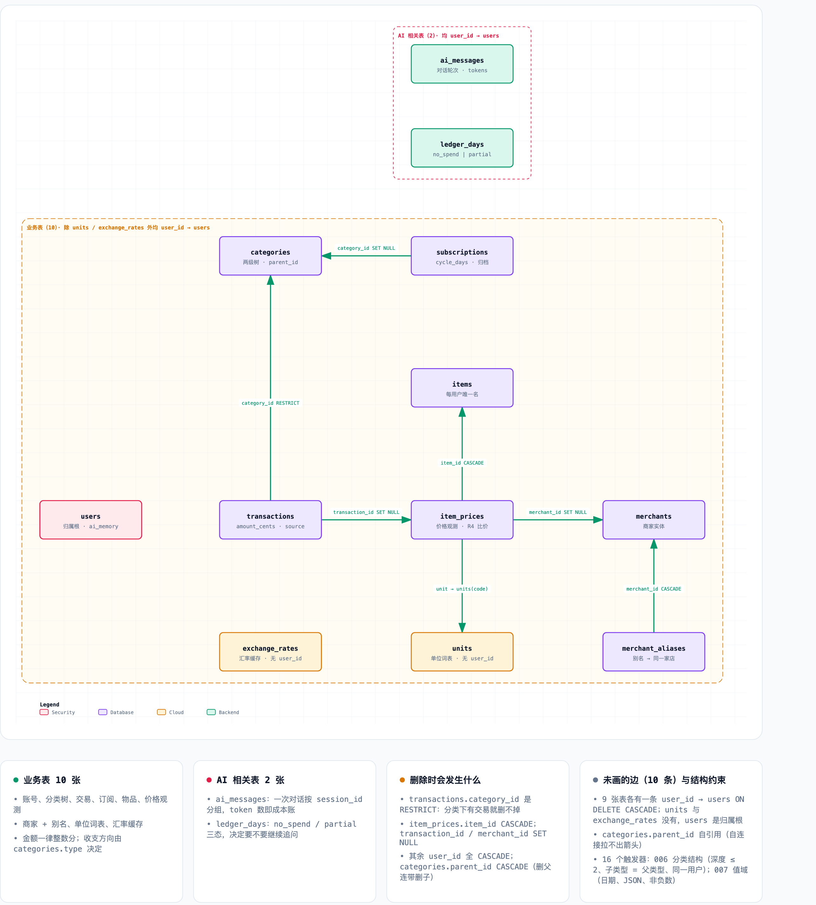

# 数据库表结构（schema v2）

12 张表 / 10 个显式索引 / **16 个触发器**。结构以本地库实际 DDL 为准（`db/schema.sql` 与
`migrations/000`–`007` 两条路径由 `scripts/verify_migration.py` 逐结构比对，必须一致）。

- 本地库：`backend-ts/.wrangler/state/v3/d1/miniflare-D1DatabaseObject/bb5754fe….sqlite`
- 远端：D1 `bookkeeping-db`（`database_id = 81d99dfc-618f-408f-8e28-d2752a807d45`）
- 行数为 2026-10-10 生产导出、应用完 000–008 之后的数据，仅作量级参考
- **有哪些分类**是数据而非结构，当前形态由 `migrations/008_category_tree.sql` 定义

## ER 关系图



交互版（可切换深色主题，可导出 PNG / JPEG / WebP / 双主题 SVG）：[database-er.html](database-er.html)；
矢量源与布局参数在 [database-er.architecture.json](database-er.architecture.json)。

改图时编辑 JSON 后重渲染（下面的 `<repo>` 指仓库根目录）：

```bash
cd ~/.agents/skills/archify
node bin/archify.mjs render architecture \
  <repo>/docs/architecture/database-er.architecture.json \
  <repo>/docs/architecture/database-er.html
```

上图是那个 HTML 的无头 Chrome 截图（PNG 是为了让本文档在 GitHub 上直接可见，HTML 无法内嵌）：

```bash
cd <repo>/docs/architecture
"/Applications/Google Chrome.app/Contents/MacOS/Google Chrome" \
  --headless=new --disable-gpu --no-sandbox --hide-scrollbars \
  --user-data-dir=/tmp/chrome-er --virtual-time-budget=4000 \
  --force-device-scale-factor=2 --window-size=1400,1700 \
  --screenshot=/tmp/er-raw.png "file://$PWD/database-er.html"
# 再去掉顶部工具栏与底部页脚：crop (200,236)-(2768,3080) → database-er.png
```

图里只画了 **7 条结构性外键**。另有 **10 条边没有画**，但它们真实存在：9 张表各有一条
`user_id → users`（`users` 是归属根，它不指向别人，是别人指向它），外加 `categories.parent_id`
自引用——自连接在这个渲染器里拉不出箭头。这 10 条都写在图下方的"未画的边"卡里。

渲染前值得知道：**架构模式的校验器不检查箭头穿过方框**（它只查组件重叠、标签碰撞、越界、
非有限坐标）。这次排版时我用脚本把 SVG 里每条路径按折线采样、逐点测是否落在方框内部，才
发现两条 `users` 连线穿过 `transactions` 和 `units`；`users` 的 9 条扇出线在这个渲染器的朴素走线
下无法不穿框，所以改为用区域标签表达归属关系。改坐标后建议照做一次。

## 全局约定

| 约定 | 说明 |
| --- | --- |
| 金额 | 一律 **整数分**（`amount_cents`、`unit_price_cents`），`CHECK (>= 0)`；收支方向由 `categories.type` 决定，不靠正负号 |
| 时间戳 | 全部 `TEXT`，一律 **ISO-8601 UTC**（`2026-10-10T08:04:52.262Z`，即 `toISOString()`）。DDL 里仍写着 `DEFAULT (datetime('now'))`，但**没有写入路径再依赖它**，且迁移 007 已把历史上由它产生的 74 行空格格式（`2026-10-10 08:04:52`）归一到 ISO——两种格式字典序不同（`' '` `0x20` < `'T'` `0x54`），混在一列里会让任何范围比较或排序出错 |
| 业务日期 | `date` / `observed_on` / `end_date` / `ledger_days.date` 为 `'YYYY-MM-DD'`，且必须是**真实日历日期**：由触发器（迁移 007）+ 服务层 `isDateOnly()` 双重强制。原因见[触发器](#附触发器16-个)：`strftime` 对无法解析的日期返回 NULL，坏日期不会报错，只会从月度汇总里消失 |
| 币种 | `TEXT` + `CHECK (length(currency) = 3)`，如 `CNY`/`USD` |
| 用户隔离 | `users` 是归属根。除 **`units`** 与 **`exchange_rates`** 外，其余 9 张表都有 `user_id → users(id) ON DELETE CASCADE`，所有查询按 `user_id` 过滤（JWT 作用域，模型无法指定用户） |
| 无行号表 | `exchange_rates`、`ledger_days` 为 `WITHOUT ROWID`（复合主键，省一层 B-tree） |
| 可选文本 | "无描述"只有 `NULL` 一种写法。`description` 曾同时存在 `''`（26 行）与 `NULL`，导致 `WHERE description IS NULL` 漏掉一半；服务层两条路径现在都归一成 `NULL`，迁移 007 清理了存量 |

### 删除级联一览（重要）

| 删除对象 | 连带行为 |
| --- | --- |
| `users` 行 | 级联清空该用户全部数据（所有子表 CASCADE） |
| `categories` 行 | `transactions.category_id` 是 **RESTRICT** → 有交易引用时**拒绝删除**（v1 是 CASCADE，会静默删掉交易，已修正） |
| `categories` 行 | `subscriptions.category_id` → SET NULL；`categories.parent_id` → CASCADE（删父分类连带删子分类） |
| `subscriptions` 行 | `transactions.subscription_id` → SET NULL（保留交易，仅断开关联） |
| `transactions` 行 | `item_prices.transaction_id` → SET NULL（保留价格记录） |
| `items` 行 | `item_prices.item_id` → CASCADE（价格历史随物品消失） |
| `merchants` 行 | `item_prices.merchant_id` → SET NULL（原始 `merchant` 文本仍在）；`merchant_aliases` → CASCADE |

---

# 第一部分：业务表（10 张）

## 1. `users` — 账号
行数：2

| 列 | 类型 / 约束 | 说明 |
| --- | --- | --- |
| `id` | INTEGER PK AUTOINCREMENT | |
| `email` | TEXT NOT NULL **UNIQUE** | 登录名 |
| `password_hash` | TEXT NOT NULL | bcrypt（`$2b$10$…`） |
| `username` | TEXT NOT NULL | 显示名 |
| `ai_memory` | TEXT，`CHECK (NULL OR length ≤ 2000)` | **AI 专用列**，见第二部分 |
| `created_at` / `updated_at` | TEXT NOT NULL DEFAULT `datetime('now')` | |

## 2. `categories` — 分类（两级树）
行数：58

| 列 | 类型 / 约束 | 说明 |
| --- | --- | --- |
| `id` | INTEGER PK AUTOINCREMENT | |
| `user_id` | NOT NULL → `users(id)` CASCADE | |
| `name` | TEXT NOT NULL | |
| `type` | TEXT NOT NULL `CHECK IN ('income','expense')` | 决定交易的收支方向 |
| `parent_id` | → `categories(id)` CASCADE，可空 | NULL = 一级分类 |
| `translations` | TEXT，可空 | 多语言显示名（JSON） |
| `created_at` | TEXT NOT NULL DEFAULT `datetime('now')` | |

索引 / 约束：
- `UNIQUE INDEX idx_categories_unique (user_id, COALESCE(parent_id, 0), name)`
  —— 用表达式索引是因为 SQLite 视 NULL 互不相等，普通 `UNIQUE(name,parent_id,user_id)` 约束不住一级分类重名。
- `INDEX idx_categories_parent (parent_id)`

> 深度 ≤ 2、子分类 `type` = 父分类 `type`、子分类与父分类**同属一个用户**：**由数据库触发器强制**（迁移 006，见
> [附：触发器](#附触发器2-个)）。`src/services/categories.ts` 里还留着一份预检查，只为给出
> 更精确的报错（比如父分类不存在时回 404），真正的约束在 DDL。

## 3. `transactions` — 交易流水（核心事实表）
行数：490

| 列 | 类型 / 约束 | 说明 |
| --- | --- | --- |
| `id` | INTEGER PK AUTOINCREMENT | |
| `user_id` | NOT NULL → `users(id)` CASCADE | |
| `category_id` | **NOT NULL** → `categories(id)` **RESTRICT** | 每笔交易必须有分类，且分类不可被删 |
| `amount_cents` | INTEGER NOT NULL `CHECK (>= 0)` | 整数分 |
| `currency` | TEXT NOT NULL DEFAULT `'CNY'` `CHECK (length=3)` | |
| `date` | TEXT NOT NULL | `'YYYY-MM-DD'`，业务日期（与 `created_at` 不同） |
| `description` | TEXT，可空 | |
| `subscription_id` | → `subscriptions(id)` SET NULL，可空 | 取代已删除的 `subscription_renewals` |
| `source` | TEXT NOT NULL DEFAULT `'manual'` `CHECK IN ('manual','ai')` | **AI 写入标记** |
| `created_at` / `updated_at` | TEXT NOT NULL DEFAULT `datetime('now')` | |

索引：
- `idx_transactions_user_date (user_id, date)` —— 列表 / 缺日检测 / 汇总
- `idx_transactions_category (category_id)` —— RESTRICT 检查 + 分类筛选
- `idx_transactions_sub (subscription_id) WHERE subscription_id IS NOT NULL` —— 部分索引，续费历史

> v1 的 `item_id` / `unit_price` / `quantity` / `unit` 四列**已移入 `item_prices`**；`last_renewed_at` 已移除，等价于该订阅交易的 `MAX(date)`。

## 4. `subscriptions` — 订阅
行数：4

| 列 | 类型 / 约束 | 说明 |
| --- | --- | --- |
| `id` | INTEGER PK AUTOINCREMENT | |
| `user_id` | NOT NULL → `users(id)` CASCADE | |
| `name` | TEXT NOT NULL | `UNIQUE (user_id, name)` |
| `icon` | TEXT，可空 | |
| `amount_cents` | INTEGER NOT NULL DEFAULT 0 | |
| `currency` | TEXT NOT NULL DEFAULT `'USD'` `CHECK (length=3)` | 注意默认值是 **USD**，与 `transactions` 的 CNY 不同 |
| `cycle_days` | INTEGER NOT NULL DEFAULT 30 `CHECK (> 0)` | 计费周期天数 |
| `end_date` | TEXT NOT NULL | |
| `category_id` | → `categories(id)` SET NULL，可空 | |
| `archived_at` | TEXT，可空 | 非 NULL = 已归档 |
| `created_at` | TEXT NOT NULL DEFAULT `datetime('now')` | |

## 5. `items` — 物品（价格历史的挂载点）
行数：15

| 列 | 类型 / 约束 |
| --- | --- |
| `id` | INTEGER PK AUTOINCREMENT |
| `user_id` | NOT NULL → `users(id)` CASCADE |
| `name` | TEXT NOT NULL，`UNIQUE (user_id, name)` |
| `created_at` | TEXT NOT NULL DEFAULT `datetime('now')` |

## 6. `item_prices` — 价格观测（R4 比价的数据基础）
行数：24

| 列 | 类型 / 约束 | 说明 |
| --- | --- | --- |
| `id` | INTEGER PK AUTOINCREMENT | |
| `user_id` | NOT NULL → `users(id)` CASCADE | |
| `item_id` | **NOT NULL** → `items(id)` CASCADE | |
| `transaction_id` | → `transactions(id)` SET NULL，可空 | **NULL = 只看到价格、没买**（"鸡蛋那家 15"），这是 R4 主场景 |
| `unit_price_cents` | INTEGER NOT NULL `CHECK (>= 0)` | 单价，整数分 |
| `quantity` | REAL，`CHECK (NULL OR > 0)` | 用 REAL 因为"半斤"存在 |
| `unit` | TEXT → `units(code)`，可空 | **必须是 `units` 里的编码**，不是自由文本；未知单位写不进来 |
| `unit_raw` | TEXT，可空 | 用户原话，如 `个` |
| `currency` | TEXT NOT NULL DEFAULT `'CNY'` `CHECK (length=3)` | |
| `merchant` | TEXT，可空 | 原始文本，**解析成功后仍保留**（兜底） |
| `merchant_id` | → `merchants(id)` SET NULL，可空 | 归一化后的实体 |
| `observed_on` | TEXT NOT NULL | 观测日期 |
| `created_at` | TEXT NOT NULL DEFAULT `datetime('now')` | |

索引：`idx_item_prices_item (item_id, observed_on)`、`idx_item_prices_tx (transaction_id) WHERE NOT NULL`、`idx_item_prices_merchant (merchant_id)`

## 7. `units` — 单位词表（唯一没有 `user_id` 的表）
行数：9（`piece, pack, liter, kg, g, ml, bottle, box, bag`）

| 列 | 类型 / 约束 | 说明 |
| --- | --- | --- |
| `code` | TEXT PRIMARY KEY | 规范值，存进 `item_prices.unit` |
| `name` | TEXT NOT NULL | 展示名 |

> 这是**共享封闭词表，不是用户数据**：价格只在同一单位内比较才有意义，"12.8/个" 和 "12.8/pack" 不是同一个价。未知单位直接写入失败，而不是拆成两种拼写。

## 8. `merchants` — 商家实体
行数：1

| 列 | 类型 / 约束 |
| --- | --- |
| `id` | INTEGER PK AUTOINCREMENT |
| `user_id` | NOT NULL → `users(id)` CASCADE |
| `name` | TEXT NOT NULL，`UNIQUE (user_id, name)` |
| `created_at` | TEXT NOT NULL DEFAULT `datetime('now')` |

## 9. `merchant_aliases` — 商家别名
行数：0

| 列 | 类型 / 约束 | 说明 |
| --- | --- | --- |
| `id` | INTEGER PK AUTOINCREMENT | |
| `user_id` | NOT NULL → `users(id)` CASCADE | |
| `merchant_id` | NOT NULL → `merchants(id)` CASCADE | |
| `alias` | TEXT NOT NULL，`UNIQUE (user_id, alias)` | 让 "永辉" 和 "永辉超市" 在比价时是同一家 |
| `created_at` | TEXT NOT NULL DEFAULT `datetime('now')` | |

索引：`idx_merchant_aliases_m (user_id, alias)`

## 10. `exchange_rates` — 汇率缓存
行数：2（`USD/CNY 6.6927`、`USD/USD 1.0`）

| 列 | 类型 / 约束 |
| --- | --- |
| `base_currency` | TEXT NOT NULL `CHECK (length=3)` |
| `target_currency` | TEXT NOT NULL `CHECK (length=3)` |
| `rate` | REAL NOT NULL |
| `fetched_at` | TEXT NOT NULL DEFAULT `datetime('now')` |

`PRIMARY KEY (base_currency, target_currency) WITHOUT ROWID`

> **upsert 语义**：每个币种对一行。v1 是每次抓取追加一行，已修正。

---

# 第二部分：AI 相关表（2 张）

## 11. `ai_messages` — 对话轮次
行数：35

| 列 | 类型 / 约束 | 说明 |
| --- | --- | --- |
| `id` | INTEGER PK AUTOINCREMENT | |
| `user_id` | NOT NULL → `users(id)` CASCADE | 模型无法指定用户，JWT 决定 |
| `session_id` | TEXT NOT NULL DEFAULT `'default'` | **一次对话的标识**（迁移 005）。刷新页面 = 新会话；模型只看当前会话，旧会话留库不删 |
| `role` | TEXT NOT NULL `CHECK IN ('user','assistant','tool')` | |
| `content` | TEXT，**可空** | 纯工具调用的一轮没有文本；"没说话" 与 "只发起了调用" 必须能区分（迁移 003） |
| `tool_calls` | TEXT，可空 | |
| `tokens_in` | INTEGER NOT NULL DEFAULT 0 | 成本核算 |
| `tokens_out` | INTEGER NOT NULL DEFAULT 0 | |
| `created_at` | TEXT NOT NULL DEFAULT `datetime('now')` | 90 天保留期按此列清理 |

索引：`idx_ai_messages_session (user_id, session_id, id)`
- 按会话加载上下文走这个索引；成本核算按 `(user_id, created_at)` 过滤，由 `user_id` 前缀服务。
- **没有单独的 `usage_log` / 每日上限表**：token 计数就在这张表上，需要时 `SUM(tokens_*)`。

写入方：`src/services/conversation.ts`（唯一读写点）。

## 12. `ledger_days` — 已确认的"无支出日"
行数：0

| 列 | 类型 / 约束 | 说明 |
| --- | --- | --- |
| `user_id` | NOT NULL → `users(id)` CASCADE | |
| `date` | TEXT NOT NULL | |
| `status` | TEXT NOT NULL DEFAULT `'no_spend'` `CHECK IN ('no_spend','partial')` | `no_spend` = 用户确认这天没花钱，别再问；`partial` = 记了一部分但没确认完整，**仍要继续问** |
| `created_at` | TEXT NOT NULL DEFAULT `datetime('now')` | |

`PRIMARY KEY (user_id, date) WITHOUT ROWID`

> 三态而非两态的原因（迁移 003）：AI 问 3 号，用户答"午饭 20"，这天既不是空的、也谈不上确认完整。没有第三个状态，AI 就无法判断要不要再问。
> 缺日检测只看"行是否存在"：`no_spend` 和 `partial` 都表示已被问过，不再重复提醒。

写入方：`src/services/gaps.ts`（AI 工具 `mark_no_spend` / `mark_partial`，以及 `POST /ai/gaps/no-spend`）。

---

## 附：AI 层写入的"业务表"字段

业务表与 AI 表并非完全切割，AI 会写业务表：

| 位置 | 说明 |
| --- | --- |
| `users.ai_memory` | R5 的跨会话短便签（≤2000 字符）。每轮对话开始作为快照读入 prompt，不重放历史消息。读写点 `src/services/memory.ts` |
| `transactions.source = 'ai'` | AI 记账写入的交易；`'manual'` 为界面手工录入。两者同表同约束，写入前都过服务端校验 |
| `item_prices` / `merchants` / `merchant_aliases` / `units` | R4 比价数据。表本身属业务侧，但主要由 AI 工具 `log_price` / `resolve_merchant` 驱动写入（`/prices`、`/units` 也已暴露为 HTTP 接口） |
| `transactions.subscription_id` | AI 记订阅续费时关联 |

## 附：索引清单（10 个显式索引）

| 索引 | 表 | 服务场景 |
| --- | --- | --- |
| `idx_transactions_user_date` | transactions | 列表 / 缺日 / 汇总 |
| `idx_transactions_category` | transactions | RESTRICT 检查、分类筛选 |
| `idx_transactions_sub` | transactions | 续费历史（部分索引） |
| `idx_categories_unique` | categories | 真正的分类名唯一性（表达式索引） |
| `idx_categories_parent` | categories | 分类树 |
| `idx_item_prices_item` | item_prices | 价格历史 / "比上次便宜吗" |
| `idx_item_prices_tx` | item_prices | 交易反查价格（部分索引） |
| `idx_item_prices_merchant` | item_prices | 按商家比价 |
| `idx_merchant_aliases_m` | merchant_aliases | 别名解析 |
| `idx_ai_messages_session` | ai_messages | 会话窗口 |

另有 6 个由 `PRIMARY KEY` / `UNIQUE` 约束隐式创建的索引（`sqlite_autoindex_*`）：`users.email`、`subscriptions(user_id,name)`、`items(user_id,name)`、`units.code`、`merchants(user_id,name)`、`merchant_aliases(user_id,alias)`。两张 `WITHOUT ROWID` 表（`exchange_rates`、`ledger_days`）的复合主键即表本身，不额外产生索引。

## 附：触发器（16 个）

两组触发器，都用同一套 `<CODE>: <prose>` 约定。`db/schema.sql` 与对应迁移文件里是
**逐字节相同**的语句（校验器按存储 SQL 比对触发器，改一处必须改另一处）。

### 分组一：分类结构（迁移 006，2 个）

| 触发器 | 时机 | 拦下什么 |
| --- | --- | --- |
| `trg_categories_structure_insert` | BEFORE INSERT | **父分类属于别的用户**；挂到"已经是子分类"的父上（深度 3）；父类型与自身不同 |
| `trg_categories_structure_update` | BEFORE UPDATE | 自己当自己的父；**父分类属于别的用户，或把行改到别的用户名下**；挂到非根父上或自己已有子分类（深度 3）；父类型与自身不同；**改类型时留下类型不符的子分类** |

为什么必须是触发器：三条规则都要把当前行和**同表的其他行**比较，而 SQLite 的 `CHECK` 不允许
子查询，`PRAGMA foreign_keys` 也表达不了（父行是存在的，错的是它的形状或归属）。

`CATEGORY_CROSS_USER` 这条防的不是报表算错，而是**数据从界面上消失**：`buildCategoryTree`
按单个用户的 `user_id` 取数建 map，父分类不在 map 里时该分类会被静默丢弃——它躺在库里却看不见。
服务层的 `assertParentAllowed()` 本来就会拦（返回 **404 而不是 403**，避免确认别人的分类存在），
触发器兜住的是不过服务层的那几条路径。

### 分组二：值域（迁移 007，14 个）

每个表一对 `BEFORE INSERT` / `BEFORE UPDATE`：

| 表 | 错误码 | 拦下什么 |
| --- | --- | --- |
| `transactions` | `INVALID_DATE` | `date` 不是真实的 `YYYY-MM-DD` |
| `item_prices` | `INVALID_DATE` | `observed_on` 同上 |
| `subscriptions` | `INVALID_DATE` / `NEGATIVE_AMOUNT` | `end_date` 同上；`amount_cents` 为负 |
| `ledger_days` | `INVALID_DATE` | `date` 同上 |
| `categories` | `INVALID_JSON` | `translations` 非 NULL 却不是 JSON |
| `ai_messages` | `INVALID_JSON` / `NEGATIVE_TOKENS` | `tool_calls` 非 JSON；`tokens_in`/`tokens_out` 为负 |
| `exchange_rates` | `NON_POSITIVE_RATE` | `rate` 为 0 或负 |

**为什么这组也是触发器而不是 CHECK**——尽管这些规则本身完全可以用 CHECK 表达。因为 SQLite
不能给已有表加约束，加 CHECK 等于重建表，而其中三张表被别表引用：

```
categories    <- categories.parent_id (CASCADE)、transactions.category_id (RESTRICT)、
                 subscriptions.category_id (SET NULL)
transactions  <- item_prices.transaction_id (SET NULL)
subscriptions <- transactions.subscription_id (SET NULL)
```

`DROP TABLE` 会做一次隐式 DELETE，从而对**刚拷好的行**触发那些 ON DELETE 动作——迁移 002 记录了
这两个陷阱，当年不得不把整库的表都"寄存"一遍才躲过去。所以"给 categories 加个 CHECK"实际上是
五张表的寄存式重建，而它防的是这个库从未出现过的值。如果哪天因为这些表要重建，顺手把它们改成
CHECK 是件好事。

日期这一条特别值得说：**判据必须是空值安全的**。直觉写法 `NEW.date <> date(NEW.date)` 是错的——
`date()` 对无法解析的值返回 **NULL**，`x <> NULL` 求值为 NULL，而触发器/CHECK 的 WHERE 把 NULL
当作"通过"。那样写只拦得住"能解析但会被归一化"的值（如 `2026-02-30`），而 `'yesterday'`、
`'2026-3-5'`、`'2026-13-45'` 会直接放行。库里用的是 `date(NEW.date) IS NOT NEW.date`。

这组规则防的失效模式：`summary.ts` / `queries.ts` 按 `strftime('%Y-%m', date)` 分组，而 `strftime`
对无法解析的日期**返回 NULL 而不是报错**——一笔坏日期的交易不会失败，它会从所有月度汇总里消失。
`INVALID_JSON` 同理：列只是 TEXT，而读取方直接 `JSON.parse`，一行坏值曾能让整个分类列表 500。

服务层也做同样的校验（`utils/time.ts` 的 `isDateOnly`，覆盖 HTTP 与 AI 工具两条路径），
且对日期复用**同一个 `INVALID_DATE` 代码**：是服务层还是数据库拦下的，对调用方是无关的实现细节。

错误消息形如 `<CODE>: <prose>`，`src/services/errors.ts` 的 `asServiceError()` 把它翻回
400 并保留 code（`CATEGORY_DEPTH` / `CATEGORY_TYPE_MISMATCH` / `CATEGORY_SELF_PARENT`），
HTTP 与 AI 工具两条路径共用同一判断。

**改子树类型要先摘下来。** 父和子不能逐个改类型——改父时子还是旧类型，改子时父还是旧类型，两边
都会被拒。正确顺序（迁移 006 的注释里也写了）：

```sql
UPDATE categories SET parent_id = NULL WHERE id = <child>;  -- 先摘成一级
UPDATE categories SET type = 'income' WHERE id = <parent>;   -- 此时已无子分类
UPDATE categories SET type = 'income' WHERE id = <child>;
UPDATE categories SET parent_id = <parent> WHERE id = <child>;
```

> 反面做法是把类型变更级联给子分类，那样第一条语句就会成功并静默改写未知数量的行——正是这些
> 触发器要防的失效模式。

## 附：已删除的表（迁移 002）

`subscription_renewals`（由 `transactions.subscription_id` 取代）、`utility_readings` / `utility_types` / `utility_addresses`（功能已移除）、`ai_conversations`（0 行，由 `ai_messages` 取代）、`change_log`（无引用者）。
